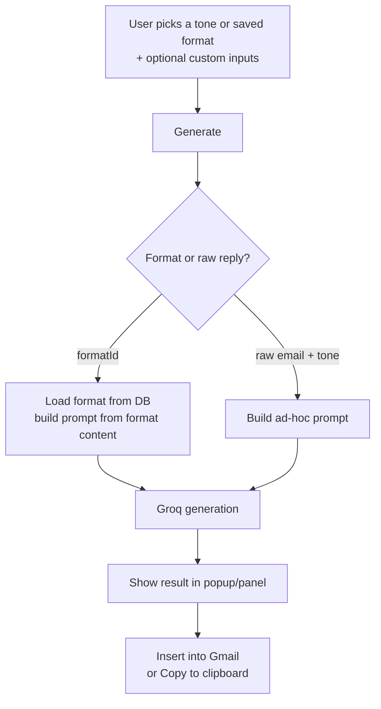

# FlashMail.ai

**AI-powered email reply assistant** — draft, polish, and insert professional emails from Gmail or your browser in seconds.

FlashMail.ai combines a Next.js admin dashboard, an Express API that talks to Groq's `openai/gpt-oss-120b` model, and a Chrome/Firefox extension that lives inside the Gmail compose window. Pick a tone or a saved format, get a draft, and inject it straight into your email — signature preserved.

---

## Table of Contents

- [Highlights](#highlights)
- [Architecture](#architecture)
- [How It Works — Flow](#how-it-works--flow)
- [Features](#features)
- [The Browser Extension](#the-browser-extension)
- [Use Cases](#use-cases)
- [Monorepo Layout](#monorepo-layout)
- [Getting Started](#getting-started)
- [Environment Variables](#environment-variables)
- [Database & Migrations](#database--migrations)
- [Commands](#commands)
- [Tech Stack](#tech-stack)

---

## Highlights

- ✨ **Generate from Gmail** — a purple sparkle button appears in the compose/reply toolbar; one click drafts the email for you.
- 🎨 **14 tones** — Professional, Formal, Casual, Friendly, Polite, Apologetic, Appreciative, Encouraging, Direct, Assertive, Supportive, Empathetic, Sarcastic, Humorous.
- 📋 **Saved formats** — reusable templates with custom inputs (e.g. *Job Application*, *Cold Outreach*). Every new account gets 3 defaults automatically.
- ✉️ **Compose AND reply modes** — draft a brand-new email (with a generated subject line) or reply to an existing thread (no subject, Gmail keeps `Re:`).
- 🧷 **Signature-safe injection** — your Gmail signature is never sent to the AI, never overwritten; generated content is inserted *above* it.
- 🔐 **Supabase auth + RLS** — per-user data isolation enforced at the database level.

---

## Architecture

```
┌────────────────────────────┐        ┌─────────────────────────────┐
│   Browser Extension (MV3)  │        │   Admin Dashboard (Next.js) │
│   Gmail content script     │        │   /login /signup /generate  │
│   popup + toolbar button   │        │   /formats /profile         │
└────────────┬───────────────┘        └──────────────┬──────────────┘
             │ chrome.runtime.sendMessage            │ HTTP (fetch)
             ▼                                       ▼
┌──────────────────────────────────────────────────────────────┐
│                    Express 5 API  (:8081)                    │
│  /api/auth  (signup, login, refresh, profile)                │
│  /api/email (generate)                                       │
│  /api/formats (CRUD)                                         │
└──────┬──────────────────────────────────┬────────────────────┘
       │ Groq chat completions            │ Supabase Admin SDK
       ▼                                  ▼
┌──────────────┐                 ┌─────────────────────────────┐
│  Groq API    │                 │  Supabase (PostgreSQL+Auth) │
│ openai/gpt-  │                 │  auth.users → formats table │
│ oss-120b     │                 │  RLS: each user owns rows   │
└──────────────┘                 └─────────────────────────────┘
```

### Components

| Component | Location | Role |
|---|---|---|
| **API** | `apps/api/` | Express 5 REST API. Zod-validated bodies, Supabase Admin SDK for DB access, Groq for generation. |
| **Admin** | `apps/admin/` | Next.js App Router dashboard. Auth via Supabase SSR client; format management, export/import, and one-off email generation. |
| **Extension** | `apps/extension/` | Chrome MV3 / Firefox WebExtension. Content script injects a toolbar button into Gmail; popup offers tones, formats, and manual generation. |
| **Shared packages** | `packages/*` | Zod schemas, DB query helpers, prompt templates, and config/env loading shared across apps. |

---

## How It Works — Flow

### 1. Reply flow (Gmail toolbar)

```mermaid
flowchart LR
    A[Open Gmail reply] --> B[Sparkle button injected<br/>into compose toolbar]
    B -->|click ✨| C[Content script grabs<br/>original email + draft + tone]
    C --> D[background.js POST /api/email/generate]
    D --> E[Express validates body<br/>via Zod schema]
    E --> F[Groq generates reply]
    F --> G[API returns { reply }]
    G --> H[Content script inserts text<br/>above signature in compose box]
```

### 2. Compose flow (new email)

```mermaid
flowchart LR
    A[Click Compose] --> B[Tone dropdown beside<br/>AI sparkle button]
    B -->|click ✨| C[Content script sends mode=compose<br/>+ draft + tone]
    C --> D[POST /api/email/generate]
    D --> E[Prompt instructs model to emit<br/>'Subject: ...' then body]
    E --> F[API parses subject + body<br/>returns { subject, reply }]
    F --> G[Subject filled into Gmail subject box<br/>Body inserted above signature]
```

### 3. Popup / dashboard flow



### Data flow (who touches the Gmail DOM)

```
popup.js ──chrome.tabs.sendMessage──▶ content.js ──chrome.runtime.sendMessage──▶ background.js ──fetch──▶ Express API
     ▲                                 │  ▲                                        │
     └────────── response ─────────────┘  └── Gmail DOM (compose box, subject box, toolbar) ──┘
```

- **`content.js`** is the *only* file that touches the Gmail DOM — it finds the compose box, subject box, signature, and toolbar; it inserts generated text and injects the AI button.
- **`background.js`** does *all* API calls (auth, formats, generate) and token refresh.
- **`popup.js`** orchestrates the UI; it never talks to the DOM directly.

---

## Features

### Email Generation
- **Reply to existing emails** — the original email is read from the thread (signature excluded) and the model responds point-by-point.
- **Compose new emails** — the model generates a `Subject:` line and body; the subject is pasted into Gmail's subject box, the body above your signature.
- **Polish existing drafts** — highlight whatever is in the compose box and ask the AI to rewrite it.

### Formats (reusable templates)
- Create/edit/duplicate/delete formats with a name, mode (`email` / `reply`), tone, and content instructions.
- Custom inputs let you fill in blanks per-use (e.g. company name, role).
- **Export/Import** — export selected formats as JSON, or restore them later.
- **Default formats for new users** — a Supabase trigger seeds 3 formats (`Formal Reply`, `Casual Reply`, `Cold Outreach Email`) on every new signup. They are per-user copies, so editing never conflicts with other users.

### Tones
- 14 built-in tones selectable in the popup, the dashboard, and the Gmail toolbar tone dropdown.

### Auth & Multi-user
- Supabase Auth (email/password) with server-side sessions in the admin app and token storage in the extension.
- Row-Level Security: `formats` are scoped to `auth.uid()`.

### Browser Integration
- MV3 extension for Chrome and WebExtension for Firefox (built from the same source with a dual-manifest build script).
- Works in Gmail's pop-out compose windows and multiple compose windows (targets the last visible one).

---

## The Browser Extension

The extension is the flagship integration — it meets you where you already write email.

| Aspect | Detail |
|---|---|
| **Manifest** | MV3 (Chrome), WebExtension (Firefox) — built from `apps/extension/manifests/` |
| **Permissions** | `storage`, `activeTab`; host access to `mail.google.com` |
| **Toolbar button** | A purple-gradient sparkle `[✨][▼]` group inserted into the compose toolbar, *before the delete icon*, in `tr.btC`. Tooltip changes by mode: **AI Compose — Polish your message** vs **AI Reply — Draft your reply**. |
| **Tone dropdown** | Small chevron beside the sparkle icon opens the 14-tone menu (opens upward when near the bottom edge). |
| **Popup** | Sign in / Sign up, pick a format or raw email + tone, generate, then **Insert into Gmail** (also inserts subject in compose mode) or copy. |
| **Signature handling** | Signature is detected (`.gmail_signature`), removed from the text sent to the AI, and re-appended at the bottom after insertion — never edited or deleted. |
| **Robust insertion** | Visibility-filtered box lookup (handles Gmail's hidden inputs), native value setter + `InputEvent` for the subject, `execCommand('insertText')` fallback, explicit range selection. |
| **Build** | `bun run build:extension` → `dist/chrome`, `dist/firefox`, and `flashmail-firefox.zip`. |

---

## Use Cases

### 1. Daily email triage
> You have 40 unread emails. Open a reply, click the sparkle, pick **Professional** tone, and get a clean draft you can tweak and send — signature already in place.

### 2. Job applications at scale
> Save a **Job Application** format (mode: email) with custom inputs for company and role. When applying, pick the format, fill the two inputs, and FlashMail writes the whole email **including the subject line**.

### 3. Cold outreach
> Use the **Cold Outreach Email** default format (or your own), choose a warm tone, and generate personalized first-touch emails from a short prompt.

### 4. Apologetic / sensitive replies
> Type one rough sentence, click **Polish**, and let the AI rewrite it in an **Apologetic** or **Empathetic** tone without the emotional friction of drafting it yourself.

### 5. Consistent team tone
> Share formats across a team. Each member gets their own editable copies of the defaults, so the tone stays consistent without merge conflicts.

### 6. Email drafting on the go
> Use the popup directly — no Gmail tab needed — to draft a reply, copy it, and paste it anywhere (mobile, other clients, etc.).

---

## Monorepo Layout

```
FlashMail.ai/
├── apps/
│   ├── api/                    # Express 5 backend (port 8081)
│   │   ├── src/
│   │   │   ├── controllers/    # auth, email (generate), formats
│   │   │   ├── middleware/     # validate (Zod), requireAuth, errorHandler
│   │   │   ├── routes/         # /api/auth, /api/email, /api/formats
│   │   │   ├── services/       # ai (Groq), format, supabase-auth
│   │   │   └── validators/     # Zod schemas re-exported
│   │   └── migrations/         # SQL run in Supabase SQL Editor
│   ├── admin/                  # Next.js App Router dashboard
│   │   └── src/app/
│   │       ├── (app)/          # authenticated: generate, formats, profile
│   │       ├── (auth)/         # login, signup
│   │       └── page.tsx        # landing page
│   └── extension/              # Chrome + Firefox MV3 extension
│       ├── content.js/css      # Gmail DOM integration
│       ├── background.js       # API calls + token refresh
│       ├── popup.html/js/css   # popup UI
│       ├── options.html/js     # settings
│       ├── manifests/          # chrome + firefox manifests
│       └── scripts/build.mjs   # builds dists + firefox zip
├── packages/
│   ├── configs/                # env loading, Supabase client factory
│   ├── schemas/                # Zod schemas (shared FE/BE)
│   ├── models/                 # Supabase DB query helpers
│   └── utils/                  # prompt templates, shared utilities
├── turbo.json
└── package.json                # Bun workspace root
```

---

## Getting Started

### Prerequisites
- [Bun](https://bun.sh) >= 1.4
- A Supabase project (PostgreSQL + Auth)
- A Groq API key

### Install

```bash
bun install
```

### Configure

Copy `.env.example` to `.env` and fill in the values (see [Environment Variables](#environment-variables)).

### Run in development

```bash
turbo dev          # API (:8081) + admin (:3000) together
turbo dev --filter=api      # API only
turbo dev --filter=admin    # dashboard only
```

### Load the extension

1. `bun run build:extension` → outputs `apps/extension/dist/chrome` (and `dist/firefox` + `flashmail-firefox.zip`).
2. Chrome: open `chrome://extensions` → enable **Developer mode** → **Load unpacked** → select `apps/extension/dist/chrome`.
3. Firefox: open `about:debugging` → **This Firefox** → **Load Temporary Add-on** → pick the zip.
4. In `options.html`, set the API URL (default `http://localhost:8081`).

### Apply database migrations

Run the SQL files in `apps/api/migrations/` in order in the Supabase **SQL Editor**:

1. `2026-07-31-formats.sql` — creates the `formats` table + RLS.
2. `2026-07-31-seed-users.sql` / `2026-07-31-seed-formats.sql` — optional seed data for a test user.
3. `2026-08-17-seed-default-formats-trigger.sql` — seeds 3 default formats for every new user via a trigger on `auth.users`.

---

## Environment Variables

| Variable | Used by | Purpose |
|---|---|---|
| `GROQ_API_KEY` | API | Groq API key (required). |
| `AI_MODEL` | API | Optional model override (default `openai/gpt-oss-120b`). |
| `SUPABASE_URL` | API | Supabase project URL. |
| `SUPABASE_ANON_KEY` | API | Anon key for the Admin SDK / RLS-scoped client. |
| `SUPABASE_SERVICE_KEY` | API | Service key for privileged operations. |
| `NEXT_PUBLIC_SUPABASE_URL` | Admin | Supabase URL for the browser SSR client. |
| `NEXT_PUBLIC_SUPABASE_ANON_KEY` | Admin | Anon key for the browser client. |
| `API_URL` | Admin | Express API base (default `http://localhost:8081`). |

---

## Database & Migrations

The single source of truth for data is Supabase (PostgreSQL).

### `formats` table

| Column | Type | Notes |
|---|---|---|
| `id` | `uuid` | PK |
| `user_id` | `uuid` | FK → `auth.users(id)`, `ON DELETE CASCADE` |
| `name` | `text` | Format name |
| `mode` | `text` | `email` or `reply` |
| `tone` | `text` | Default tone (e.g. `Formal`) |
| `content` | `text` | Format instructions (≤ 500 words) |
| `created_at` / `updated_at` | `timestamptz` | Timestamps |

**RLS:** `USING (auth.uid() = user_id)` — every user manages only their own rows.

### Default formats trigger

```sql
create trigger on_user_signup
after insert on auth.users
for each row execute function public.seed_default_formats();
```

On any new signup it inserts three per-user copies — `Formal Reply`, `Casual Reply`, `Cold Outreach Email` — so new accounts are immediately useful and can delete/edit them freely without affecting anyone else.

---

## Commands

| Command | What it does |
|---|---|
| `bun install` | Install all workspace deps |
| `turbo dev` | Run API + admin in dev mode |
| `turbo build` | Build all apps |
| `bun run build:extension` | Build Chrome dist, Firefox dist, and Firefox zip |
| `bun run dev:api` | API only |
| `bun run dev:admin` | Admin only |
| `bun run format` | Prettier across the repo |

---

## Tech Stack

| Layer | Tech |
|---|---|
| Backend | Express 5, Zod, Supabase Admin SDK |
| Frontend | Next.js (App Router), shadcn/ui, lucide-react, sonner, next-themes |
| AI | Groq Inference API (`openai/gpt-oss-120b`, overridable via `AI_MODEL`) |
| Auth/DB | Supabase (PostgreSQL + Auth + RLS) |
| Extension | Chrome MV3 / Firefox WebExtension, vanilla JS content scripts |
| Tooling | Bun, Turborepo, TypeScript, Prettier |

---

## License

Private project — all rights reserved.